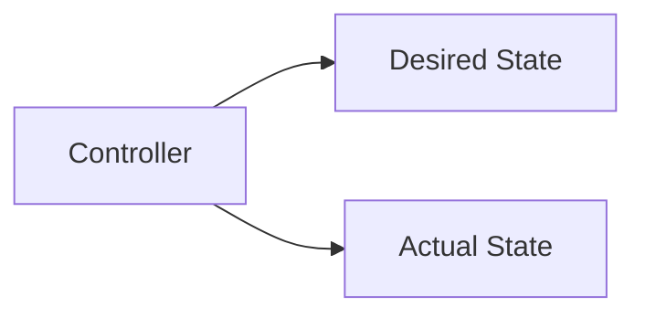
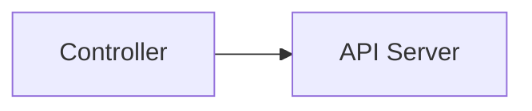
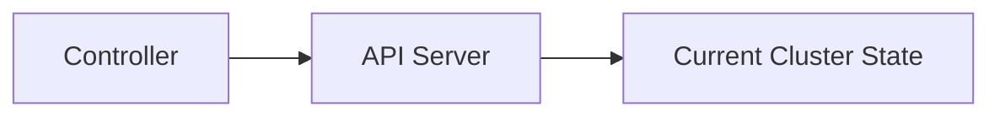

# Markdownformat für Slide-Beschreibungen

## 1. Grundprinzip

Eine Datei mit der Endung `.slides.md` enthält eine oder mehrere Slides.
Diese Slides entsprichen genau einem Subject, wie in `.claude/STYLE.md` beschrieben.
In der Regel enthält eine einzige Slide aber der User darf entscheiden, ob er mehrere benötigt.

Die Struktur wird ausschließlich durch feste Markdown-Überschriftenebenen beschrieben:

| Ebene | Bedeutung      | Syntax                   |
| ----- | -------------- | ------------------------ |
| H1    | Slide          | `# Slide: <Subtopic>`    |
| H2    | Linker Eintrag | `## Step: <Subject>`     |
| H3    | Rechte Sequenz | `### Sequence: <render>` |
| H4    | Sequenzelement | `#### Element: <type>`   |

Die Reihenfolge im Dokument bestimmt sowohl:

* die Reihenfolge der Slides,
* die Reihenfolge der linken Einträge,
* die Reihenfolge der Elemente innerhalb einer Sequenz.

Eine zusätzliche Animationsnummerierung ist nicht erforderlich.

---

## 2. Frontmatter

Jede Datei beginnt mit dem bestehenden Frontmatter-Format.

Zusätzlich werden der Formatname und dessen Version angegeben:

```yaml
---
revision: 1
path: "Slides/03.01-Kubernetes-Architecture.slide.md"
title: "Kubernetes Architecture Slides"
abstract: "Slide definitions for the Kubernetes architecture lesson."
state: in progress
lang: en
numbersections: false
format: workshop-slides
format_version: 1
history:
  - "v1: initial version"
---
```

### Zusätzliche Felder

* `format`: muss `workshop-slides` sein.
* `format_version`: Version der Slide-Syntax, beginnend mit `1`.

Diese Versionsangabe erlaubt spätere Erweiterungen, ohne bestehende Dateien mehrdeutig zu machen.

---

## 3. Slide

Eine Slide beginnt mit einer H1-Überschrift.

### Slide mit Titel

```markdown
# Slide: Kubernetes Reconciliation
```

Der Text nach `Slide:` ist die sichtbare Überschrift der Slide.

### Slide ohne Titel

```markdown
# Slide
```

Eine Slide muss mindestens einen `Step` enthalten.

---

## 4. Step

Ein `Step` beschreibt eine logische Einheit aus:

* einem Eintrag der linken Spalte,
* genau einer zugeordneten Sequenz der rechten Spalte.

Syntax:

```markdown
## Step: Desired State
```

Der Text nach `Step:` wird als Eintrag in der linken Spalte dargestellt.

Ein Step muss genau eine `Sequence` enthalten.

---

## 5. Sequence

Eine Sequence beschreibt die Inhalte der rechten Spalte und ihr Renderverhalten.

Syntax:

```markdown
### Sequence: additive
```

oder:

```markdown
### Sequence: replace
```

Unterstützte Render-Modi:

* `additive`
* `replace`

### `additive`

Beim Anzeigen eines neuen Elements bleiben die zuvor angezeigten Elemente derselben Sequence sichtbar.

### `replace`

Beim Anzeigen eines neuen Elements wird das zuvor angezeigte Element derselben Sequence entfernt.

Eine Sequence muss mindestens ein Element enthalten.

---

## 6. Element

Ein Element beginnt mit einer H4-Überschrift:

```markdown
#### Element: text
```

Der Text nach `Element:` bestimmt den Elementtyp.

Der Inhalt des Elements reicht bis zum nächsten:

* H4-Element,
* H3-Sequence,
* H2-Step,
* H1-Slide,
* oder bis zum Dateiende.

### Kern-Elementtypen

| Typ            | Bedeutung                               |
| -------------- | --------------------------------------- |
| `text`         | Text, Absatz oder Aufzählung            |
| `code`         | Quelltext oder Kommandozeileninhalt     |
| `image`        | Allgemeine Bilddatei                    |
| `diagram`      | Deklarativ beschriebenes Diagramm       |
| `screenshot`   | Screenshot oder Bildschirmabbildung     |
| `illustration` | Dekorative oder erklärende Illustration |

Weitere Typen dürfen nur verwendet werden, wenn sie zentral im Styleguide definiert wurden.

---

## 7. Elementinhalte

### 7.1 Text

Text wird als normales Markdown angegeben:

```markdown
#### Element: text

Kubernetes objects describe a desired state.
```

Auch Listen sind zulässig:

```markdown
#### Element: text

- The desired state is stored through the Kubernetes API.
- Controllers continuously observe the current state.
```

Ein einzelnes `text`-Element darf mehrere zusammengehörige Absätze oder Listenpunkte enthalten. Es wird trotzdem als ein Animationsinhalt behandelt.

### 7.2 Code

Code wird als gewöhnlicher Markdown-Codeblock angegeben:

````markdown
#### Element: code

```bash
kubectl get pods
```
````

### 7.3 Image, Screenshot oder Illustration

Bildbasierte Inhalte verwenden die normale Markdown-Bildsyntax:

```markdown
#### Element: image


```

Beispiel für einen Screenshot:

```markdown
#### Element: screenshot


```

Pro bildbasiertem Element ist genau eine primäre Bildreferenz zulässig.

### 7.4 Diagram

Diagramme werden bevorzugt als Mermaid beschrieben:

````markdown
#### Element: diagram


````

Alternativ darf ein bereits gerendertes Diagramm als Bild referenziert werden:

```markdown
#### Element: diagram


```

---

## 8. Vollständiges Beispiel

````markdown
---
revision: 1
path: "Slides/03.01-Kubernetes-Architecture.slide.md"
title: "Kubernetes Architecture Slides"
abstract: "Slides covering the basic Kubernetes architecture."
state: in progress
lang: en
numbersections: false
format: workshop-slides
format_version: 1
history:
  - "v1: initial version"
---

# Slide: The Reconciliation Loop

## Step: Desired State

### Sequence: additive

#### Element: text

Users describe the desired state through Kubernetes API objects.

#### Element: text

The desired state is persisted by the Control Plane.

## Step: Observe

### Sequence: replace

#### Element: diagram



#### Element: diagram



## Step: Reconcile

### Sequence: additive

#### Element: text

Controllers compare the desired state with the current state.

#### Element: text

Detected differences cause corrective actions.

# Slide: Worker Nodes

## Step: kubelet

### Sequence: additive

#### Element: text

The kubelet ensures that assigned Pods are running.

## Step: Container Runtime

### Sequence: replace

#### Element: image


#### Element: image


````

---

## 9. Ableitung der Animation

Animationsschritte werden nicht explizit in der Datei notiert. Sie werden aus der Struktur abgeleitet.

Für jeden Step gilt:

1. Beim Aktivieren des Steps werden gleichzeitig:

   * sein linker Eintrag eingeblendet,
   * sein erstes Element angezeigt.

2. Besitzt die Sequence weitere Elemente, zeigt jeder weitere Tastendruck das nächste Element.

3. Das Verhalten vorheriger Elemente wird durch `additive` oder `replace` bestimmt.

4. Nach dem letzten Element aktiviert der nächste Tastendruck den folgenden Step:

   * die rechte Spalte wird geleert,
   * der neue linke Eintrag wird eingeblendet,
   * das erste Element seiner Sequence wird angezeigt.

5. Nach dem letzten Element des letzten Steps ist die Slide vollständig dargestellt.

Damit bezeichnet `Step` weiterhin die logische Einheit aus linkem Eintrag und rechter Sequence und nicht einen einzelnen Tastendruck.

---

## 10. Formale Struktur

Vereinfacht lässt sich das Format folgendermaßen beschreiben:

```text
document
  = frontmatter slide+

slide
  = slide-heading step+

slide-heading
  = "# Slide"
  | "# Slide: " title

step
  = "## Step: " label sequence

sequence
  = "### Sequence: additive" element+
  | "### Sequence: replace" element+

element
  = "#### Element: " type element-body
```

Die strukturellen Überschriften müssen exakt die Ebenen H1 bis H4 verwenden.

---

## 11. Validierungsregeln

Eine Datei ist ungültig, wenn mindestens eine der folgenden Bedingungen erfüllt ist:

* Die Frontmatter fehlt.
* `format` ist nicht `workshop-slides`.
* `format_version` fehlt oder wird nicht unterstützt.
* Die Datei enthält keine Slide.
* Eine Slide enthält keinen Step.
* Ein Step besitzt kein Label.
* Ein Step enthält keine Sequence.
* Ein Step enthält mehr als eine Sequence.
* Eine Sequence besitzt keinen Render-Modus.
* Der Render-Modus ist weder `additive` noch `replace`.
* Eine Sequence enthält kein Element.
* Ein Element besitzt keinen Typ.
* Der Elementtyp ist unbekannt.
* Ein Element besitzt keinen Inhalt.
* Ein bildbasiertes Element enthält keine gültige Bildreferenz.
* Die Überschriftenhierarchie H1 bis H4 wird verletzt.
* Strukturelle Überschriften werden innerhalb eines Elementinhalts verwendet.

Elementinhalte dürfen deshalb keine Überschriften der Ebenen H1 bis H4 enthalten. Für interne Gliederungen können H5 und H6 verwendet werden.

---

## 12. Designentscheidungen

### Native Markdown-Inhalte

Texte, Listen, Codeblöcke, Bilder und Mermaid-Diagramme bleiben normales Markdown. Inhalte müssen nicht in YAML-Strings oder proprietäre Datenblöcke eingebettet werden.

### Explizite Struktur

Jedes fachliche Objekt besitzt eine eigene Überschriftenebene:

```text
Slide
└── Step
    └── Sequence
        └── Element
```

Dadurch kann sowohl ein KI-Agent als auch ein deterministischer Parser die Struktur eindeutig erkennen.

### Keine redundanten Animationsangaben

Das Animationsverhalten wird zentral durch die Formatdefinition bestimmt. Die einzelnen Dateien beschreiben nur:

* die Slides,
* die Steps,
* den Render-Modus,
* die geordneten Elemente.

Erster Tastendruck, Sequenzfortschritt und Step-Wechsel müssen daher nicht wiederholt pro Slide beschrieben werden.

