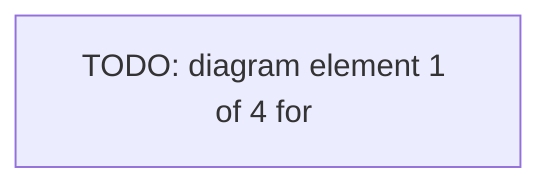

# Fill Slide

## Purpose

Create or update one subject-specific `Step` in the slide file belonging to the subject's subtopic.

The command operates only on subjects defined in `Contents.md`. It must not create new topics, subtopics, or subjects.

## Invocation

```text
/fill-slide "<Subject>" <text|code|image|diagram> [Prompt]
```

Arguments:

- `<Subject>`: either the exact subject title from `Contents.md` or its full subject number, for example `03.01.04`.
- `<text|code|image|diagram>`: element type used for every element in the subject's right-hand sequence.
- `[Prompt]`: optional remaining text after the element type. It controls the generated element contents.

A subject title containing spaces should be quoted. Treat all text after the element type as the optional Prompt.

## Authoritative Files

Read these files before making any change:

1. `.claude/STYLE.md`
2. `.claude/VISION.md`
3. `Contents.md`
4. `.claude/STYLE-SLIDES.md`

Apply their rules with the following task-specific precedence:

1. This skill's explicit target path and extension are authoritative.
2. The target file uses the singular extension `.slide.md`, even though `.claude/STYLE-SLIDES.md` currently describes `.slides.md` files.
3. For this skill, `<#subtopic>` is always the local two-digit number within its topic, for example `01`; it never contains `<#topic>`. The full subtopic number is `<#topic>.<#subtopic>`, for example `03.01`.
4. The target filename uses the full subtopic number assembled as `<#topic>.<#subtopic>`.
5. All generated file contents must be in English and consistent with `.claude/VISION.md`.

## Abort Conditions

Abort without modifying any file when any of the following applies:

- `<Subject>` is missing.
- The element type is missing or is not exactly one of `text`, `code`, `image`, or `diagram`.
- `Contents.md` cannot be parsed according to the rules below.
- No subject in `Contents.md` matches `<Subject>`.
- A title-based `<Subject>` matches more than one subject.
- The target slide file exists but its slide title is not exactly `<subtopic title>`.
- The target slide file contains no Slide, more than one Slide, or a structurally invalid Slide.
- The target slide file contains more than one Step with the target `<subject title>`.
- The target slide file's frontmatter is missing or invalid.
- The archive file exists but its frontmatter is missing or invalid.
- A requested generated element cannot satisfy `.claude/STYLE-SLIDES.md` structurally.

On abort, report the exact reason and do not perform partial writes.

## Resolve the Subject from `Contents.md`

Parse `Contents.md` structurally. Do not use substring matching.

### Topic

A topic is a Level 1 heading in the form:

```markdown
# <#topic> <topic title>
```

Ignore frontmatter, horizontal separators, and the special section `Further Reading / Links` if present.

### Subtopic

A subtopic is a Level 2 heading. Support both the canonical linked form and an unlinked heading:

```markdown
## [<#topic>.<#subtopic> <subtopic title>](...)
```

```markdown
## <#topic>.<#subtopic> <subtopic title>
```

The number shown in the heading is the full subtopic number `<#topic>.<#subtopic>`, for example `03.01`. Split it into:

- `<#topic>`: the two-digit topic number, for example `03`;
- `<#subtopic>`: the local two-digit subtopic number, for example `01`.

The topic component in the subtopic heading must match the current Level 1 topic. Abort if it does not.

### Subject

A subject is a top-level bullet directly below a subtopic and before the next Level 1 or Level 2 heading.

Support both forms:

```markdown
- [<#subject> <subject title>](...)
```

```markdown
- <subject title>
```

For an unnumbered subject, derive its full subject number by appending its one-based, zero-padded position to `<#topic>.<#subtopic>`:

```text
<#topic>.<#subtopic>.<local-subject-index>
```

For example, the fourth subject in topic `03`, subtopic `01` is `03.01.04`.

The subject title is the first line of the list item after removing an optional Markdown link and an optional leading full subject number. Indented continuation lines belong to `<subject contents>`.

### Matching

Resolve `<Subject>` as follows:

1. If it matches `NN.NN.NN`, match the full subject number exactly.
2. Otherwise, match the subject title exactly after trimming leading and trailing whitespace.
3. Matching is case-sensitive.
4. A title match must be unique across the whole file.

Resolve and retain:

- `<#topic>`
- `<topic title>`
- `<#subtopic>` as the local two-digit number
- `<full subtopic number>` as `<#topic>.<#subtopic>`
- `<subtopic title>`
- `<#subject>`
- `<subject title>`
- `<subject contents>`
- the subject's relative position inside its subtopic

## Target Paths

Use these exact paths:

```text
Contents/<#topic>-<topic title>/<#topic>.<#subtopic>-<subtopic title>.slide.md
```

```text
Contents/<#topic>-<topic title>/<#topic>.<#subtopic>-<subtopic title>.slide-removed.md
```

Example:

```text
Contents/03-Kubernetes Architecture/03.01-Overview.slide.md
```

Do not sanitize or rewrite titles beyond using the exact topic and subtopic title strings from `Contents.md`.

Create the topic directory when it does not exist.

## Slide File Structure

A newly created target file contains exactly one Slide:

```markdown
# Slide: <subtopic title>
```

Each subject is represented by one Step:

```markdown
## Step: <subject title>

### Sequence: <render mode>

#### Element: <type>

<element content>
```

The Step label contains only `<subject title>`, without its number.

## Render Mode

Derive the Sequence render mode from the requested element type:

| Element type | Render mode |
| --- | --- |
| `text` | `additive` |
| `code` | `additive` |
| `image` | `replace` |
| `diagram` | `replace` |

Create exactly one Sequence. Determine the number of Elements according to the Element Count rules below.

## Element Generation

### Element Count

Determine `<element-count>` before generating any element:

- If Prompt is absent or contains only whitespace, set `<element-count>` to exactly `4`.
- If Prompt is present, choose an integer from `3` through `8`, inclusive.
- Choose the smallest count that covers the Prompt coherently without compressing distinct concepts into one overloaded element.
- Use `.claude/VISION.md` as a binding guardrail for scope, conceptual depth, audience assumptions, terminology, and workshop progression.
- Prefer `3` or `4` elements for a narrow concept, `5` or `6` for a concept with several meaningful stages or facets, and `7` or `8` only when the Prompt genuinely requires that many distinct animation states.
- Do not pad the sequence with redundant elements merely to increase the count.
- The chosen count applies to the complete replacement Step and must be used consistently in placeholders, history entries, validation, and the result report.

### General Rules

- Create exactly `<element-count>` elements.
- Every element uses the requested type.
- Keep each element focused on one animation state or one coherent content unit.
- Do not use H1, H2, H3, or H4 headings inside element bodies.
- Do not invent facts that are not supported by `Contents.md`, the Prompt, or repository guardrails.
- Use `<subject title>` and `<subject contents>` as context when interpreting the Prompt.
- Store every generated repository-local media reference under `.media/`.

### Empty Prompt

When Prompt is absent or contains only whitespace, generate exactly four structural placeholders.

#### `text` placeholder

```markdown
#### Element: text

[TODO: text element 1 of 4 for "<subject title>"]
```

#### `code` placeholder

````markdown
#### Element: code

```text
TODO: code element 1 of 4 for "<subject title>"
```
````

#### `image` placeholder

Use a deterministic relative `.media/` path derived from the subject title. Build the slug by applying Unicode NFKD normalization, removing non-ASCII characters, converting to lowercase, replacing every run of non-alphanumeric characters with one hyphen, and trimming leading or trailing hyphens. If the result is empty, use `<#subject>` with dots replaced by hyphens.

```markdown
#### Element: image


```

The reference is a target media path. Do not claim that the file already exists.

#### `diagram` placeholder

````markdown
#### Element: diagram


````

### Non-empty Prompt

When Prompt is present:

- Follow it within the repository's scope and style rules.
- Choose `<element-count>` from `3` through `8` according to the Element Count rules.
- Produce exactly `<element-count>` complete elements.
- Keep all generated content in English, translating the Prompt when necessary.

Type-specific rules:

- `text`: use normal Markdown paragraphs or lists. Prefer one conceptual increment per element.
- `code`: use exactly one fenced code block per element. Infer the fence language from the Prompt or content. Keep examples concise and valid for the described environment.
- `image`: use exactly one primary Markdown image reference per element. Reuse filenames explicitly supplied by the Prompt, but place generated repository-local references under `.media/`. If no filenames are supplied, create deterministic target paths under `.media/` and add a concise HTML comment describing the intended visual immediately before the image reference.
- `diagram`: use Mermaid by default. Use a rendered image reference only when the Prompt explicitly requires an existing rendered diagram.

## Create or Update the Slide

Perform all changes in memory first. Write files only after the complete result and archive update have passed validation.

### Target File Does Not Exist

1. Create the topic directory if needed.
2. Create the target file with valid frontmatter.
3. Create one Slide titled `<subtopic title>`.
4. Add the generated Step for `<subject title>`.

Use this frontmatter shape:

```yaml
---
revision: 1
path: "<target path>"
title: "<#topic>.<#subtopic> <subtopic title> Slides"
abstract: "Slide definition for <#topic>.<#subtopic> <subtopic title>."
state: in progress
lang: en
numbersections: false
format: workshop-slides
format_version: 1
history:
  - "v1: created slide and added <#subject> <subject title>."
---
```

### Target File Exists and Subject Is Absent

1. Validate the file and confirm its only Slide title is exactly `<subtopic title>`.
2. Insert the new Step according to the subject order in `Contents.md`:
   - before the first existing Step belonging to a later subject in the same subtopic;
   - otherwise after the last existing Step.
3. Preserve all unrelated Steps byte-for-byte where possible.
4. Increment the frontmatter revision and append one history entry.

### Target File Exists and Subject Is Present

1. Locate the unique complete Step block beginning with:

   ```markdown
   ## Step: <subject title>
   ```

2. Generate the replacement Step.
3. If the generated Step is byte-identical to the existing Step after normalizing only trailing whitespace, perform a no-op:
   - do not archive;
   - do not increment revision;
   - do not rewrite either file.
4. Otherwise:
   - append the exact previous Step block to the archive file;
   - replace the Step in place;
   - preserve its relative position;
   - increment the slide file revision and append one history entry.

Never remove or rewrite unrelated Steps.

## Archive Replaced or Removed Steps

Whenever an existing target Step is removed as part of replacement, append its exact previous block to:

```text
Contents/<#topic>-<topic title>/<#topic>.<#subtopic>-<subtopic title>.slide-removed.md
```

### New Archive File

Create it with generic Markdown frontmatter:

```yaml
---
revision: 1
path: "<archive path>"
title: "<#topic>.<#subtopic> <subtopic title> Removed Slide Steps"
abstract: "Archive of replaced or removed slide Steps for <#topic>.<#subtopic> <subtopic title>."
state: in progress
lang: en
numbersections: false
history:
  - "v1: created archive and stored removed <#subject> <subject title>."
---

# Removed Slide Steps
```

### Archive Entry

Append the old Step verbatim, surrounded by metadata comments:

```markdown
<!-- removed-step
removed_at: <UTC timestamp in ISO 8601 format>
source: <target path>
subject: <#subject> <subject title>
reason: replaced by fill-slide
-->

<exact previous Step block>

<!-- /removed-step -->
```

Do not modify an archived Step's content, indentation, render mode, or elements.

When appending to an existing archive file:

- increment its revision;
- preserve `state: done` if it was set manually;
- otherwise change `state: not started` to `state: in progress`;
- append one history entry;
- append the new archive entry at the end of the body.

## Frontmatter Update Rules

For every changed existing file:

- increment `revision` by exactly `1`;
- preserve unknown frontmatter fields;
- preserve `state: done`;
- change `state: not started` to `state: in progress`;
- leave `state: in progress` unchanged;
- append exactly one concise history entry for the operation;
- ensure `path` exactly matches the actual repository-relative path.

Suggested slide history entries:

```text
v<revision>: added <#subject> <subject title> with <element-count> <type> elements.
```

```text
v<revision>: replaced <#subject> <subject title> with <element-count> <type> elements.
```

Suggested archive history entry:

```text
v<revision>: archived replaced <#subject> <subject title>.
```

## Validation Before Writing

Validate the complete target slide file against `.claude/STYLE-SLIDES.md` and these additional constraints:

- frontmatter `format` is `workshop-slides`;
- frontmatter `format_version` is `1`;
- exactly one Slide exists;
- the Slide title is exactly `<subtopic title>`;
- every Step has exactly one Sequence;
- the target Step exists exactly once;
- the target Step has exactly `<element-count>` Elements;
- every target Element has exactly the requested type;
- the target Sequence has the expected render mode;
- every Element has non-empty content;
- every image Element has exactly one primary Markdown image reference;
- Step order is consistent with the order of known subjects in `Contents.md`;
- no unrelated Step was removed.

When an archive change is required, validate the archive file before writing it as well.

Write the target and archive atomically. If either write would fail, write neither.

## Result Report

On success, report:

```text
Action: created | added | replaced | unchanged
Subject: <#subject> <subject title>
Slide: <target path>
Elements: <element-count> x <type>
Render: <additive|replace>
Archive: <archive path | none>
```

On abort, report:

```text
Action: aborted
Reason: <precise reason>
```
